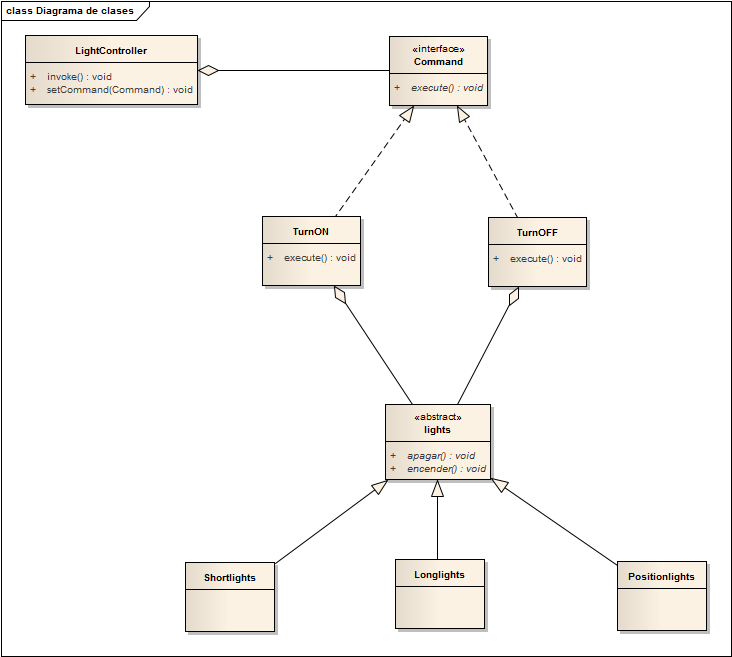

# PatternCommand - Example

# Propósito
Encapsular una petición como un objeto, de modo que puedan parametrizarse otros objetos con distintas peticiones o colas de peticiones y proporcionar soporte para realizar operaciones que puedan deshacerse.

En el contexto de programación actual un simple programa puede ejecutar decenas, o incluso centenares, de invocaciones a subprocesos o subprogramas. En ocasiones es muy conveniente desacoplar la invocación de determinados procesos del contexto donde se encuentran, y ésto es precisamente el problema que viene a solucionar el patrón Command.
Por ejemplo, un objeto botón o menú ejecuta solicitudes, pero la solicitud no está implementada dentro del mismo.
Otro ejemplo del patrón es que nos permite abstraer el código de tal manera que podamos tratar a los objetos como si fueran las ordenes que introducimos un la CLI (Interfaz de Línea de Comandos) del sistema operativo.
Además, pueden surgir situaciones en las que las invocaciones deban de tratarse por medio de una cola, pila o estructura de datos similar. Mediante el patrón Command podemos realizar estas acciones de manera sencilla.
